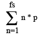

<link rel="stylesheet" type="text/css" href="style.css">

# FS cost calculator
### How it works?

It calculates the **average** probability and the cost of getting a certain amount of failstacks using +14 reblath armor (shoes). It suggests that if you get it to +15 then you drop it using a cleanse mechanic.

 This formula calculates the silver cost and the amount of blackstones, where **fs** is a desirable amount of failstacks and **p** is a chance of a previous enchant.

Reblath enchant chance is taken from ingame data. You can alter the variables for your own need.

### Things to remember

1. It's based on unofficial information, so it is just a speculation.
2. Data shows an **average** calculation. Your personal single experience may heavily vary.

## FS table

<table id="fsTable">
	<thead>
		<tr>
			<th>Failstacks</th>
			<th>Chance</th>
			<th>Attempts</th>
			<th>Cost, silver</th>
			<th>Blackstones</th>
		</tr>
	</thead>
	<tbody id="fsData">
	</tbody>
</table>

### Customize

You can enter your own data co make a calculation for other prices/probabilities below

<input type="text" id="baseVal" name="baseVal" value="0.2"> Base upgrade success chance 
<input type="text" id="fsIncrease" name="fsIncrease" value="0.02"> % increase per failstack 
<input type="text" id="maxFs" name="maxFs" value="120"> Max effective failstacks 
<input type="text" id="stoneCost" name="stoneCost" value="210000"> Blackstone cost 
<input type="text" id="armorCost" name="armorCost" value="12900"> Armor cost 
<button type="button" id="calculate" onclick="calculate();">Recalculate</button>

